# FEATURES - Table of Contents

<!-- TOC -->

- [FEATURES - Table of Contents](#features-table-of-contents)
- [Gtest-runner](#gtest-runner)
	- [Automatic test running](#automatic-test-running)
	- [Simple traffic-light output](#simple-traffic-light-output)
	- [Full console output](#full-console-output)
	- [Fully customizable layout](#fully-customizable-layout)
	- [Light and dark themes](#light-and-dark-themes)
	- [System notifications](#system-notifications)
	- [Gtest support](#gtest-support)
- [Test Executable dock](#test-executable-dock)
	- [Drag-and-drop](#drag-and-drop)
	- [Easily add and remove tests](#easily-add-and-remove-tests)
	- [Re-run test](#re-run-test)
	- [Kill test](#kill-test)
	- [gtest command line options](#gtest-command-line-options)
	- [Enable/disable autorun](#enabledisable-autorun)
	- [Test progress](#test-progress)
	- [Test path tooltips](#test-path-tooltips)
- [Test case window](#test-case-window)
	- [Detailed failure information](#detailed-failure-information)
	- [Sort failures](#sort-failures)
	- [Filter failures](#filter-failures)
- [Failure window](#failure-window)
	- [Jump to console output](#jump-to-console-output)
	- [Open in IDE](#open-in-ide)
	- [Full GTest error message](#full-gtest-error-message)
- [Console Window](#console-window)
	- [Search](#search)
	- [Next/previous failure](#nextprevious-failure)
	- [Clear output from previous runs](#clear-output-from-previous-runs)
	- [Cout](#cout)

<!-- /TOC -->

# Gtest-runner

A Qt5 based automated test-runner and Graphical User Interface for Google Test unit tests

## Automatic test running

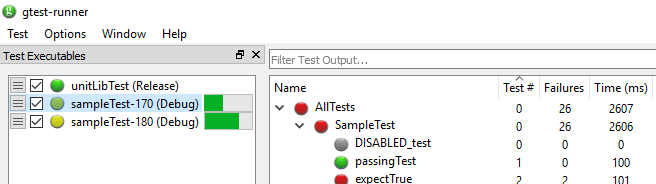

- Gtest-runner uses file system watchers do detect every time your test has changed (e.g. when you build it), and automatically re-runs the test and updates all the test case windows. This feature even works if you rebuild your test when gtest-runner is closed.
- Gtest-runner runs all of your tests in parallel, showing a progress indicator for each one.
- _Note:_ for expensive or lengthy tests, automatic test running can be disabled by unchecking the box next to the test name.

## Simple traffic-light output

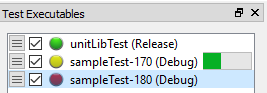

-  - A green light means that the test was run and all test cases passed with no errors.
-  - A yellow light means that the test has changed on disc and needs to be re-run. If your test executable is corrupted, deadlocks, or segfaults, you may see a test in a "hung" yellow state.
-  - A red light means that the test executable failed at least one test case. 
-  - A gray light indicates that the test is disabled, _or_ if autorun is disabled it can also indicate that test output is out-of-date.

## Full console output

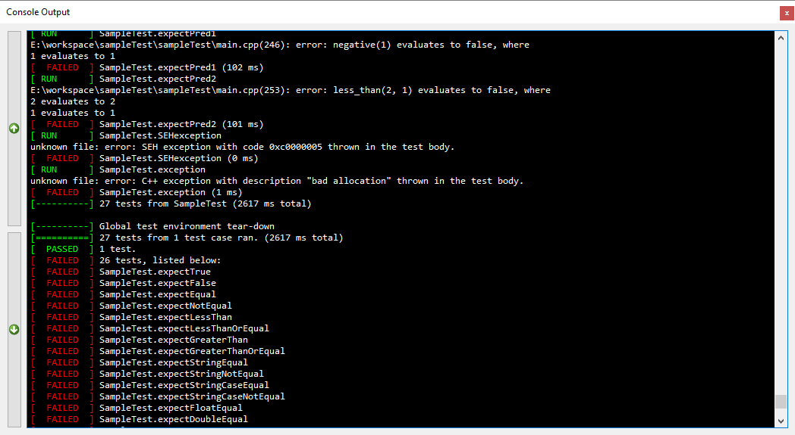

- All gtest console output is reatined (including syntax highlighting) and piped to the built-in console dock, so you get all the benefits of a GUI without losing any of your debugging output. Plus, `gtest-runner` adds additional capabilities like a [search dialog](#search-failures) and [forward and backward failure navigation buttons](#nextprevious-failure).

## Fully customizable layout

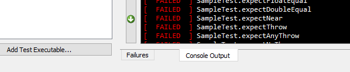

- Gtest-runner uses detachable docks for the test executable, failure, and conosle docks, so you can tab, rearrange, detach, or hide them to best suite your screen layout.

## Light and dark themes

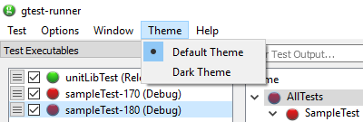 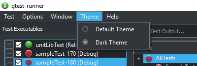

- Easily switch between your system's default color theme or a breeze-inspired dark theme.

## System notifications

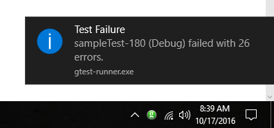

- When a test is autorun in the background, gtest-runner will generate a system notification letting you know if any tests failed. Notifications can also (optionally) be configured for tests which pass during autorun.
- _Note:_ notifications aren't generated for tests which are run manually (since you are presumably already looking at the output).

## Gtest support

- Gtest-runner supports both `gtest-1.7.0` and `gtest-1.8.0` style output.

# Test Executable dock

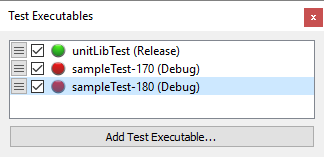

## Drag-and-drop

- To add a test executable to watch, simply drag-and-drop the test executable file anywhere on the `gtest-runner` GUI.

## Easily add and remove tests

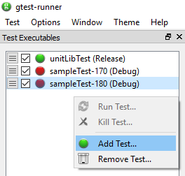

- In addition to drag-and-drop, it's easy to add or remove a test using the right-click context menu in the `Test Executable` window.

## Re-run test

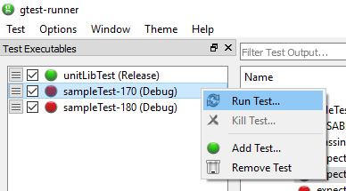

- You can manually re-run a test at any time by right-clicking on it and selecting `Run Test...`

## Kill test

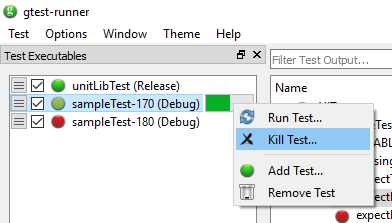

- Did you just actually click run on your 4-hour CPU intensive test? No problem! Cancel a test at any time by right-clicking on it, and selecting `Kill Test...`.
- _Hint:_ if the `Kill Test...` option is grayed out, that means your test isn't running (even if it has a yellow indicator).

## gtest command line options

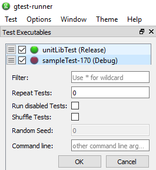

- Clicking on the hamburger menu to the left of the test executable name will pop up the `gtest command line` dialogue, allowing access to all of the options you'd have if you ran your test directly from a terminal.

## Enable/disable autorun

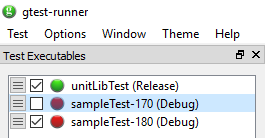

- Compiling frequently, or have a resource-intensive test that you don't want running in the background? Whatever the reason, it's simple to disable autorun by un-checking the autorun box next to the test executable name.

## Test progress

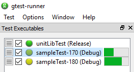

- Each running test displays a progress bar indicator. Measured progress is based on the number of tests completed out of the overall number of tests, not time-to-go.

## Test path tooltips

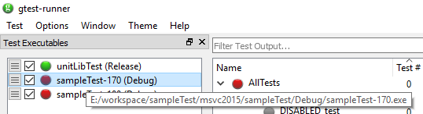

- Mousing over any of the test executables will show the full path to the test as a tooltip. This can be useful for disambiguating multiple tests with the same name. On Windows, `Debug` and `Release` builds are differentiated automatically.

# Test case window

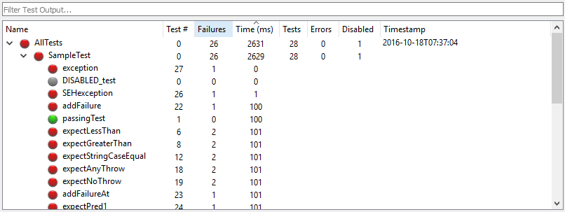

## Detailed failure information

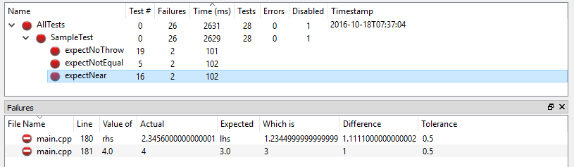

- Clicking on any failed test case will display detailed information about each `EXPECT/ASSERT` failure in the `Failures` window.
- _Note:_ No detailed information is available for test cases which pass or are disabled.

## Sort failures

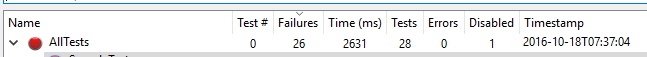

- The test case list can be sorted by any column. The default sort is the to show the tests in order. To change sort, just click on any of the column headers. Click the header again the alternate between ascending/descending order.
- _Note:_ The current sort column is indicated by the arrow ofabove the column title (in this example, `Failures`).

## Filter failures

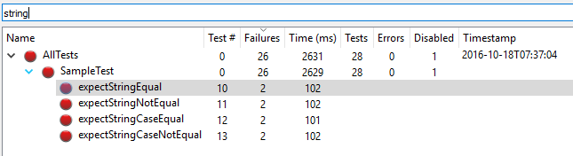

- Filter the test cases displayed by typing into the filter text box. Only matching results will be shown.
- _Note:_ The filter text edit accepts regex filters as well!

# Failure window

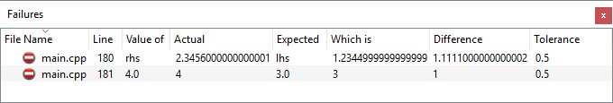

## Jump to console output

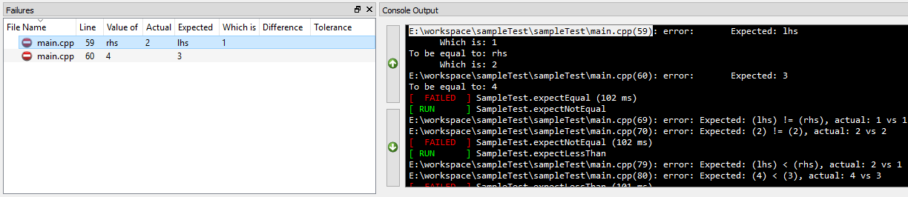

- Single clicking any failure in the failure window will automatically jump to the corresponding output in the gtest console.

## Open in IDE

- Double clicking any failure will automatically open the file in your IDE (or whichever program is associated with the file extension). It will also copy the line number of the failure to the clipboard. In almost every editor, you can then quickly jump to the failure location with the shortcut `Ctrl-G, Ctrl-V, ENTER`.

## Full GTest error message

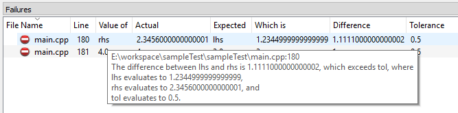

- Hovering the mouse over any failure will show a tool-tip with the original, un-parsed gtest error message.

# Console Window

## Search

- Open a `Find` window with the keyboard shortcut `Ctrl-F`, or by right clicking in the console window and selecting it from the menu. You can use the `Find` dialog to search the console output for specific failures or `std::cout` messages.

## Next/previous failure

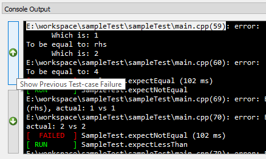

- Use the buttons on the left side of the console window to quickly scroll to the next or previous failure.

## Clear output from previous runs

- Is your console output getting cluttered with too many runs? Easily clear it by selecting the clear option from the right-click context menu.

## Cout

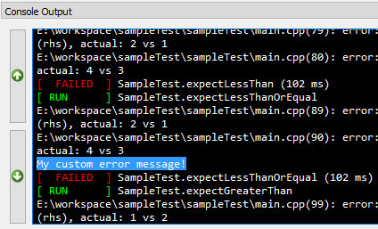

- Like to mix `std::cout` debuggin with your gtests? No problem! All of your custom error messages are visible in the console window.