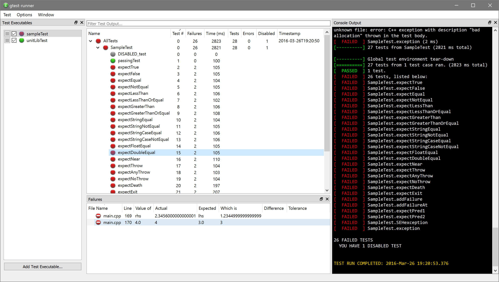
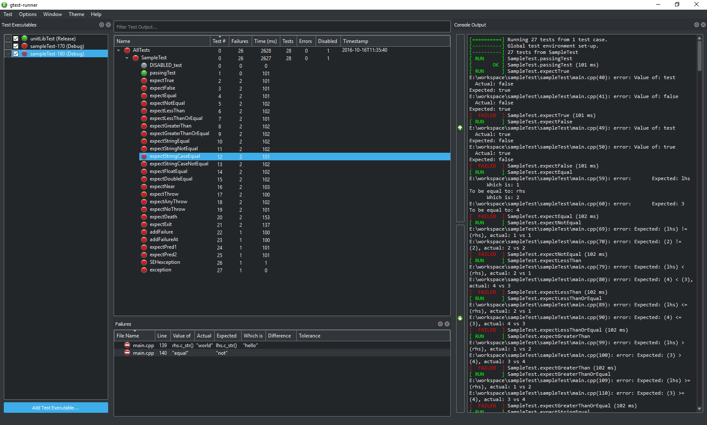

# gtest-runner 
[](https://travis-ci.org/nholthaus/gtest-runner) [](https://ci.appveyor.com/project/nholthaus/gtest-gui)     <br>   


A Qt5 based automated test-runner and Graphical User Interface for Google Test unit tests

# Table of Contents

<!-- TOC -->

- [gtest-runner](#gtest-runner)
- [Table of Contents](#table-of-contents)
- [Light Theme](#light-theme)
- [Dark Theme](#dark-theme)
- [Features](#features)
- [Supported Platforms](#supported-platforms)
- [Installers](#installers)
	- [Windows](#windows)
	- [Ubuntu](#ubuntu)
	- [Other Linux Distributions](#other-linux-distributions)
- [Build Instructions](#build-instructions)

<!-- /TOC -->

# Light Theme


# Dark Theme


# Features

`gtest-runner` is an automated test runner that will ensure you are always looking at the latest test results, whenever you build a gtest executable. Check the [features guide](FEATURES.md) to see what else `gtest-runner` is capable of.

# Supported Platforms

To date, gtest-runner has been tested on:
- Windows 10/7
- Ubuntu 16.04/15.10/14.04
- CentOS 7

# Installers

## Windows

Visit the [Latest release page](https://github.com/nholthaus/gtest-runner/releases) for binary installers. 

Since version 1.1.2, all Windows binaries are signed.

## Ubuntu

Binary packages are available through the [gtest-runner PPA](https://launchpad.net/~nholthaus/+archive/ubuntu/gtest-runner) for many versions of Ubuntu. To install gtest-runner via the PPA, type the following commands:

```bash
sudo add-apt-repository ppa:nholthaus/gtest-runner
sudo apt-get update
sudo apt-get install gtest-runner
```

Of course, you can also [build gtest-runner from source](BUILD.md).

## Other Linux Distributions

Please see the instructions on [how to build gtest-runner from source](BUILD.md).

# Build Instructions

See the [Build Instructions](BUILD.md) for information on how to build gtest-runner from source on your platform.
